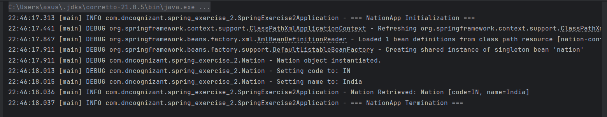

# Exercise 2 – Spring Core: Load Country from Spring Configuration XML

This exercise demonstrates loading a `Nation` bean from a Spring configuration XML file.

---

## 🔹 Features:
- `Nation` class with `code` and `name` properties
- Spring XML configuration using `beans`
- Loading and displaying bean from `ApplicationContext`

---

## 🔹 Technologies Used:
- Spring Core
- XML Configuration (`nation-config.xml`)
- SLF4J for logging

---

## Output:
