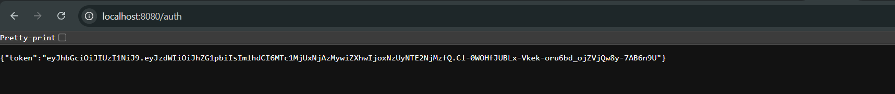

# Exercise 6 – Authentication Service with JWT

A secure authentication endpoint that accepts Basic Auth and returns a JWT token upon successful login.

---

## 🔹 Features:
- Basic authentication using username/password
- JWT generation using custom utility class
- `/auth` endpoint returns JWT on success

---

## 🔹 Technologies Used:
- Spring Boot
- Spring Security
- JWT (JSON Web Tokens)
- Base64 encoding

## Output:

