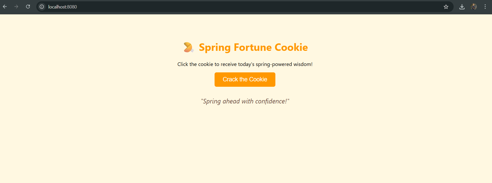

# Exercise 1 – Spring Web Project using Maven

This project sets up a basic Spring Web project using Maven to manage dependencies and project structure.

---

## 🔹 Features:
- Maven project structure with `pom.xml`
- Spring Boot web application setup
- Entry point with `@SpringBootApplication`

---

## Output:
