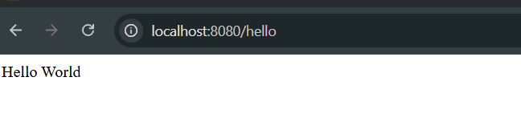

# Exercise 3 – Hello World RESTful Web Service

A simple REST API that returns a "Hello World" message using Spring Boot.

---

## 🔹 Features:
- GET `/hello` endpoint
- Returns "Hello World"

---

## Output:
