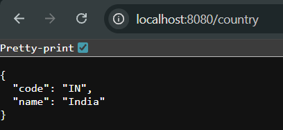

# Exercise 4 – REST: Country Web Service (Spring XML Bean via REST)

This RESTful Spring Boot application demonstrates how to expose a Spring-configured bean (`Country`) via a REST API.

---

## 🔹 Features:
- Loads `Country` bean from `spring.xml` configuration
- Exposes the bean via `/country` REST endpoint
- Uses Spring Core + Spring Web

---

## Output:
