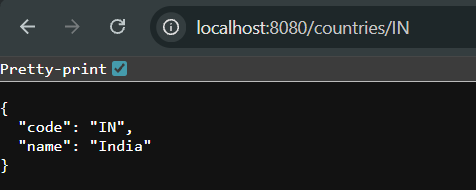

# Exercise 5 – REST: Get Country by Code

This RESTful API returns a single country based on the country code provided in the URL.

---

## 🔹 Features:
- GET `/countries/{code}`
- Returns a `Country` object matching the code
- Java Maps for in-memory storage

---

## Output:
