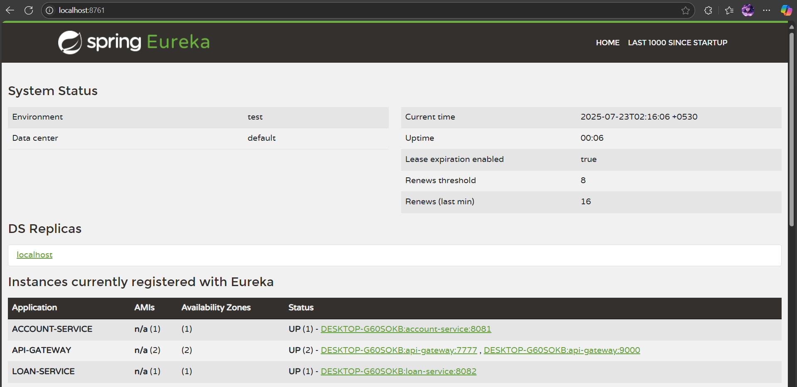

# Exercise – Microservices Architecture

A complete microservices ecosystem featuring service registration, discovery, and a centralized API gateway for routing client requests.

---

## 🔹 Features

- Two independent business microservices (**Account** and **Loan**).
- Centralized service discovery using a **Eureka Server**.
- Single entry point for all API requests via **Spring Cloud Gateway**.
- Dynamic, load-balanced routing from the gateway to downstream services.

---

## 🔹 Technologies Used

- Spring Boot
- Spring Cloud Gateway
- Spring Cloud Netflix Eureka
- Spring Data JPA
- H2 In-Memory Database

---

## 🔹 Architecture & Flow

The primary output of this system is a functioning, decoupled architecture. A client request follows this path:

1.  An external client sends a request to the **API Gateway** (e.g., `GET /api/accounts/1`).
2.  The **Gateway** checks its routing rules and sees the request should go to the `account-service`.
3.  It asks the **Eureka Server** for the current location of a healthy `account-service` instance.
4.  The **Gateway** forwards the request to the correct `account-service` instance, which then processes it.

You can monitor the status of all registered services on the Eureka Dashboard:

